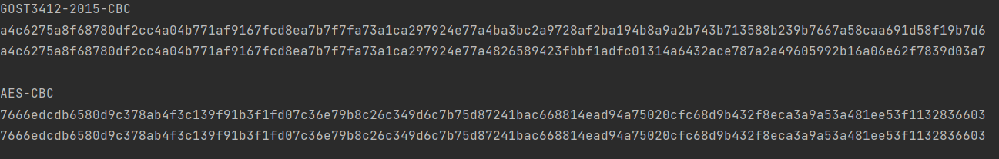

# Шифрование файлов ГОСТ 34.12-2015 *"Кузнечик"*

## Используемые библиотеки
1. Bouncy Castle v.1.77 **(BC)**.
## Запуск
1. Установить зависимость **Bouncy Castle** согласно `pom.xml`.
2. Запустить `src/main/java/main.java`.
# Описание
Это неплохой пример, как стоит шифровать файлы. Код нужно 
дорабатывать под конкретные задачи. 
## Проблемы
1. Проблема связана с реализацией метода `update(byte[] data)` 
в провайдере `bouncycastle`. 

    

    Работает реализация неправильно.
Файл `src/main/test/java/EncryptionTest.java` демонстрирует 
некорректную работу провайдера с `GOST3412-2015-CBC`. В сравнении: 
реализация 
с `AES` дает ожидаемые результаты (шифротексты полностью 
совпдают).
2. Вследствие п.1 корректно можно зашифровать в режимах отличных от 
`ECB` только "цельные" тексты. Проблема в том, что если данных много,
и хочется шифровать "кусками" (а так можно, если при корректной
реализации), то с реализацией от **BC** так, увы, не получится.

   Конечно, результат-то получится, и его даже можно корректно расшифровать 
   аналогичным способом. Но шифротекст получаемый при таком 
зашифровании не соответствует шифротексту, который должен 
получиться при цельном зашифровании всех блоков сразу.
3. И множество других косяков, которые мне было лень вспоминать...